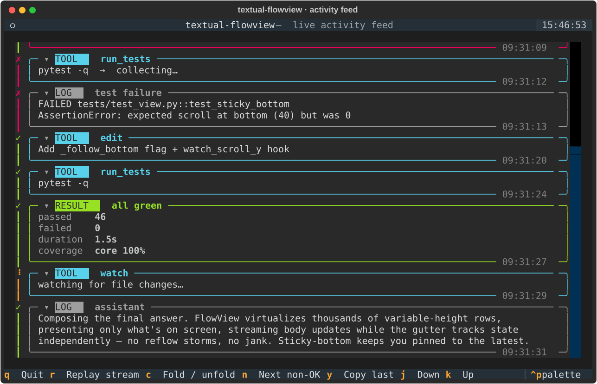
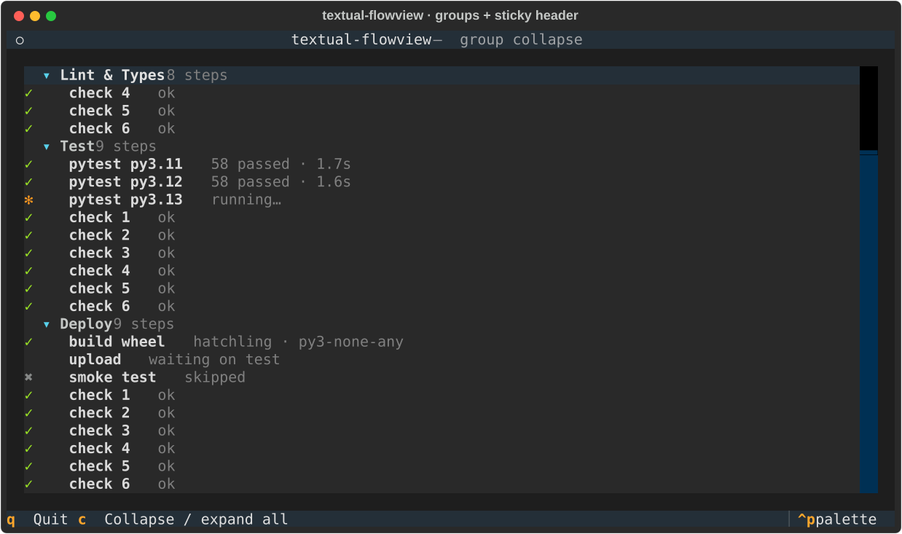
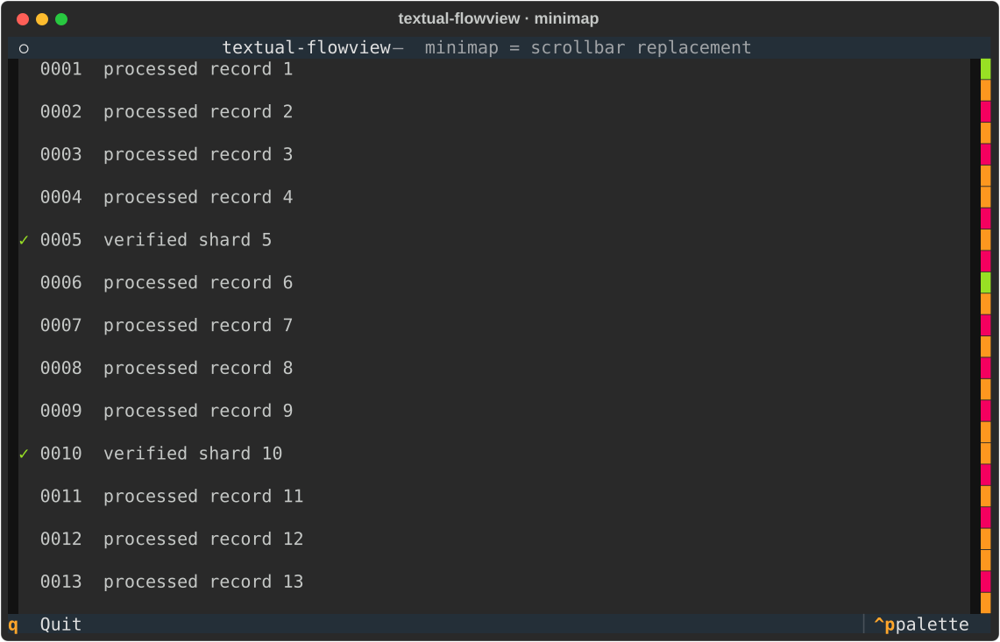

# textual-flowview

[](https://github.com/tya5/textual-flowview/actions/workflows/ci.yml)
[](https://www.python.org/)
[](https://textual.textualize.io/)
[](LICENSE)

*A virtualized Flow View widget for [Textual](https://textual.textualize.io/).*

`textual-flowview` displays **large collections of variable-height items**
efficiently — chat, timelines, git history, event logs, notifications, mail,
AI agent transcripts. None of these are special-cased. The widget only ever
deals with a **Model + Presenter**.



<table>
<tr>
<td></td>
<td></td>
</tr>
</table>

## Core ideas

- **`FlowModel[T]`** owns an ordered collection of items and knows nothing
  about the UI.
- **`Entry`** is the single stable handle to a displayed item — the only way
  to update or remove it.
- **`FlowPresenter`** is the only component that knows the concrete item type;
  it turns an item into a **`Presentation`** (height + renderable).
- **`FlowView`** draws `Presentation`s and manages the viewport. It never sees
  your data type.

## Handle-based API

`append` / `insert` return an `Entry`. There is no `model.update(item)` — the
entry *is* the identity, which keeps mutable and in-place-mutated items safe:

```python
from textual_flowview import FlowModel

conversation = FlowModel()

entry = conversation.append(ChatMessage(role="assistant", text=""))
entry.item.text += "Hello"
entry.update()                 # bumps revision → re-present
entry.item.text += " World"
entry.update()

entry.remove()                 # no-op if already removed
```

## Body & Gutter (state / metadata)

Each row is split into a **gutter** and a **body**:

```text
┌────────┬──────────────────────────────┐
│ Gutter │             Body             │
└────────┴──────────────────────────────┘
```

* The **body** is what `FlowPresenter` produces.
* The **gutter** is what a `FlowDecorator` produces — status markers, icons,
  badges, timestamps.

They update **independently**. Changing an entry's state or metadata redraws
only the gutter — the body is *not* re-presented and nothing re-layouts, so
high-frequency status updates stay cheap:

```python
from textual_flowview import EntryState, StateDecorator

flow = FlowView(
    model=model,
    presenter=ChatPresenter(),
    decorator=StateDecorator(),   # gutter markers per EntryState
    gutter_width=2,
)

entry = model.append(msg)
entry.set_state(EntryState.RUNNING)   # gutter only  ✻
entry.update()                        # body re-presented
entry.set_state(EntryState.SUCCESS)   # gutter only  ✓
entry.set_metadata("time", "09:31")   # gutter only, arbitrary data
```

`EntryState` provides `DEFAULT / RUNNING / SUCCESS / ERROR / CANCELLED`. Write
your own decorator for full control:

```python
class MyDecorator:
    def decorate(self, entry, width, height):
        return Text("●" if entry.metadata.get("unread") else " ", style="cyan")
```

A presenter exception both renders an error body and flips the entry to
`EntryState.ERROR` (so the gutter shows it) without crashing the app.

## Collapse & group collapse

Two kinds of collapse fall out of the design:

**Per-item collapse** is purely a presenter concern — no library feature
needed. Keep a `collapsed` flag on your item; present a compact renderable when
set; call `entry.update()` to reflow:

```python
async def present(self, item, width):
    if item.collapsed:
        return Presentation(height=1, renderable=Text(f"▸ {item.title}"))
    return Presentation(height=full, renderable=Panel(...))   # ▾ expanded
```

**Group collapse** uses the library's entry-visibility primitive. Hidden
entries stay in the model and keep their cached presentation (showing them
again is instant and never re-presents), but contribute no height and aren't
drawn:

```python
entry.hidden          # bool
entry.hide()          # exclude from the view
entry.show()          # re-include
entry.set_hidden(True)
```

A collapsible header is then just hiding a run of child entries — see
`examples/groups.py`:

```python
def collapse_group(header, children):
    header.item.collapsed = True
    header.update()                 # redraw the ▸ chevron
    for child in children:
        child.hide()                # the group-collapse primitive
```

Which entries belong to a group is up to you — grouping policy varies by app,
so the library ships the visibility primitive rather than a fixed hierarchy.

## Sticky headers

Pin the current group's header to the top while scrolling through it. Tell
FlowView which entries are headers with a predicate; the pinned header swaps as
you cross group boundaries, and the next header pushes the previous one up:

```python
FlowView(
    model=model,
    presenter=presenter,
    sticky_header=lambda e: e.item.kind == "header",
)
```

Style the pinned rows via the `flowview--sticky-header` component class. See
`examples/groups.py`.

## Minimap (scrollbar replacement)

`FlowMinimap` is a thin overview strip that **replaces the scrollbar**: it
compresses the whole flow into one column, painting each row in the colour of
its most notable state (red = error) and highlighting the on-screen range as
the "window" (a content-aware scroll thumb). Click or drag it to jump.

```python
from textual.containers import Horizontal
from textual_flowview import FlowView, FlowMinimap

def compose(self):
    self.view = FlowView(model=m, presenter=p)
    with Horizontal():
        yield self.view
        yield FlowMinimap(flow_view=self.view)

# hide the native scrollbar so the minimap stands in for it:
# CSS:  FlowView { scrollbar-size-vertical: 0; }
```

State→colour is overridable (`FlowMinimap(..., colors={EntryState.ERROR: "magenta"})`)
and the window band is themed via the `flowminimap--window` component class.
See `examples/minimap.py` (a 400-line scan log — errors are visible at a glance).

## Keys & focus

FlowView is **unopinionated about keys** — it defines no `BINDINGS` of its own,
so it never conflicts with your app's shortcuts. The only keys it responds to
are the standard scroll keys (arrows, Home/End, PageUp/PageDown) inherited from
Textual's `ScrollableContainer`, and only while the widget is focused — Textual
resolves keys through the focus chain, so FlowView never globally captures them.
<kbd>Ctrl</kbd>+<kbd>C</kbd> copy is Textual's own Screen binding, not ours.

Customize with any standard Textual mechanism:

- override keys in your `App` / `Screen` / a `FlowView` subclass via `BINDINGS`;
- set `flow.can_focus = False` so it never grabs scroll keys (wheel still works);
- bind your own keys to the public methods (`scroll_to_bottom`, `find_next`,
  `copy_entry`, …).

The library never binds a key to an action for you — that's your app's call.

## Scroll anchoring

```python
from textual_flowview import Anchor

FlowView(model=..., presenter=..., anchor=Anchor.CURRENT)          # default
FlowView(model=..., presenter=..., anchor=Anchor.STICKY_BOTTOM)    # chat / log
```

`STICKY_BOTTOM` follows new items **only while the user is already at the
bottom** — scrolling up to read history stops the auto-follow (Slack / Discord
/ Claude Code behaviour).

## Smooth scrolling (overscan & read-ahead)

FlowView only presents what's on (or near) screen. Two knobs control how much
it prepares ahead of time so scrolling reveals real content, not placeholders:

```python
FlowView(model=..., presenter=..., overscan=4, read_ahead=None)
```

- **`overscan`** — extra rows presented above *and* below the viewport (a
  static cushion around the visible range).
- **`read_ahead`** — extra rows pre-presented *in the direction you're
  scrolling*, on top of overscan. `None` (default) uses one viewport height;
  `0` disables it. Larger = smoother fast scrolling at the cost of presenting
  more up front.

## Selection

Single-entry click selection (v0.3). The selection lives on the view, not the
item, and posts a message you can react to:

```python
class MyApp(App):
    def on_flow_view_selected(self, event: FlowView.Selected) -> None:
        entry = event.entry            # the selected Entry, or None
        ...

flow.select(entry)         # programmatic
flow.clear_selection()
flow.selected              # -> Entry | None
```

Style the highlight via the `flowview--selected` component class:

```css
FlowView > .flowview--selected { background: $accent 30%; }
```

## Rich renderables, indicators & animation

An entry's view is a plain **`rich.console.RenderableType`** — the same type a
Textual widget returns from `render()`. So any Rich/Textual renderable drops
straight into a `Presentation`: `Panel`, `Table`, `Syntax`, `Markdown`, and the
built-in indicators `rich.spinner.Spinner` and `rich.progress_bar.ProgressBar` —
no custom drawing.

FlowView caches an entry's render and redraws only on `update()` / metadata
change, so animation is app-driven — tick a timer and advance the frame:

- **Gutter indicator** (spinner via `set_metadata`) — redraws only the gutter,
  never the body, never reflows. Cheapest.
- **Body indicator** (progress bar via `update()`) — re-presents the body; no
  reflow at fixed height.

See `examples/progress.py` (Rich `Spinner` + `ProgressBar`).

> Interactive Textual **widgets** (`Button`, `Select`, `Input`) are a different
> thing — FlowView paints renderables rather than mounting child widgets, so
> those aren't hosted per entry. For clickable controls, draw them and hit-test
> `FlowView.Clicked` (below).

## Interaction & content replacement

`FlowView` paints Rich renderables — it doesn't mount a real widget per row.
To build **clickable controls inside the flow** (buttons, option chips, an
intervention selector), draw them in the presenter and hit-test the click:
`FlowView.Clicked` reports the entry *and the position within it*, so you know
which control was pressed.

```python
class MyApp(App):
    def on_flow_view_clicked(self, event: FlowView.Clicked) -> None:
        entry, col, row = event.entry, event.x, event.y   # x,y local to the entry body
        ...
```

Replace a specific item's content at any time — mutate it and `entry.update()`,
or swap the whole object with `entry.set_item(new)` (handy for immutable items
via `dataclasses.replace`). Either re-presents just that entry. See
`examples/intervention.py` for a clickable selector that resolves via
`set_item`.

## Search

Query entries with a predicate (over the item, state, or metadata) and jump to
hits. Search covers the whole model — including hidden entries inside collapsed
groups — and `reveal()` un-hides a hit before scrolling to it:

```python
errors = flow.find(lambda e: e.state is EntryState.ERROR)

hit = flow.find_next(lambda e: "TODO" in e.item.text)   # after the selection, wraps
flow.find_previous(predicate)
if hit:
    flow.reveal(hit)        # un-hide if collapsed, then scroll into view
```

## Public API (widget)

| Method | Effect |
| :- | :- |
| `scroll_to_top()` / `scroll_to_bottom()` | Jump to either edge. |
| `scroll_to_entry(entry)` | Put `entry` at the top. |
| `ensure_visible(entry)` | Scroll the minimum to reveal `entry`. |
| `reveal(entry)` | Un-hide if collapsed, then ensure visible. |
| `select(entry)` / `clear_selection()` | Change selection. |
| `find(pred)` / `find_next(pred)` / `find_previous(pred)` | Search entries. |
| `entry_text(entry)` / `copy_entry(entry)` | Get / copy an entry's rendered text. |

Clipboard copy uses Textual's own `App.copy_to_clipboard` (OSC 52):
`entry_text(entry)` returns the entry's rendered body as plain text, and
`copy_entry(entry)` copies it and returns it. Bind it to a key for a copy
action (see `examples/showcase.py`, `y`).

### Mouse text selection

FlowView plugs into **Textual's native text selection**: drag to select across
entries, and <kbd>Ctrl</kbd>+<kbd>C</kbd> copies (Textual's built-in binding).
It works by stamping each rendered cell with its content offset and
implementing `get_selection`, so selections are stable across scrolling and use
the standard `screen--selection` style. No configuration needed — it's on by
default (`ALLOW_SELECT`).

## Examples

```bash
PYTHONPATH=src python examples/showcase.py       # live AI-agent activity feed
PYTHONPATH=src python examples/groups.py          # collapsible groups + sticky headers
PYTHONPATH=src python examples/intervention.py    # clickable in-flow selector
PYTHONPATH=src python examples/progress.py        # Rich Spinner + ProgressBar in entries
PYTHONPATH=src python examples/minimap.py         # minimap replacing the scrollbar
PYTHONPATH=src python examples/chat.py            # streaming chat
```

`showcase.py` demonstrates variable-height panels, a colored per-state gutter,
streaming updates, and sticky-bottom auto-follow in one screen.

## License

MIT
